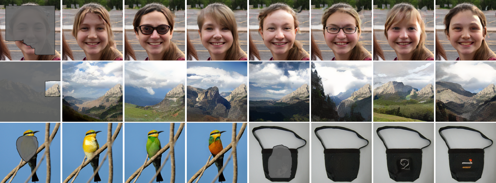
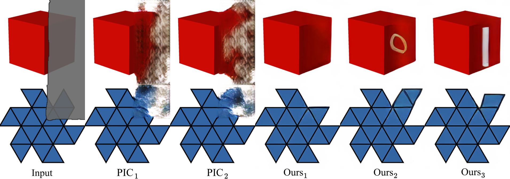
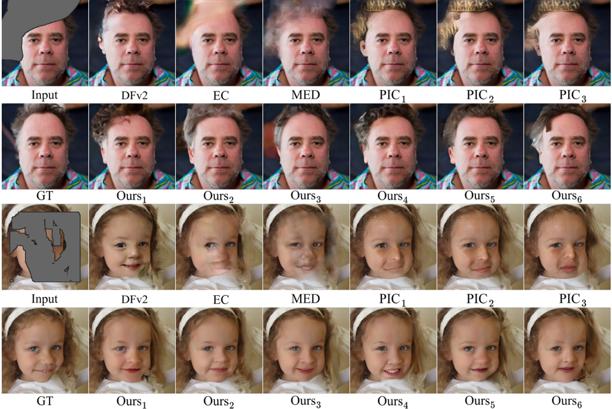
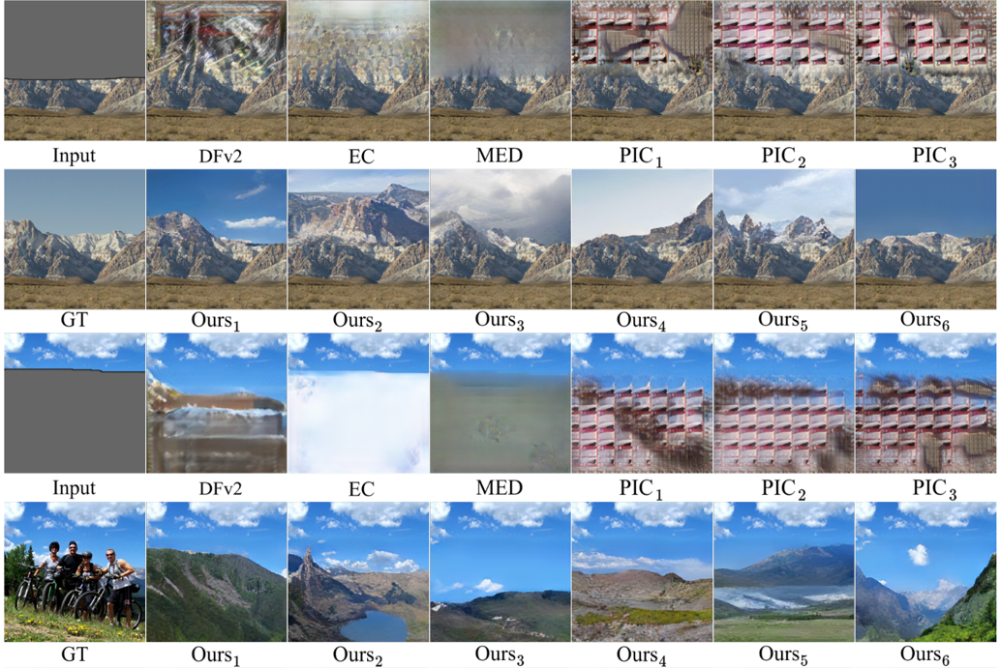
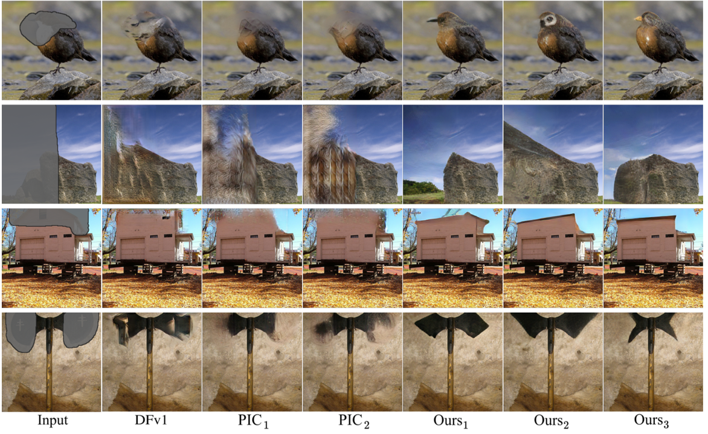

# Image Completion Transformer (ICT)



### [Project Page](http://raywzy.com/ICT/) | [Paper (ArXiv)](https://arxiv.org/pdf/2103.14031.pdf) | [Pre-trained Models](https://www.dropbox.com/s/we886b1fqf2qyrs/ckpts_ICT.zip?dl=0) :fire: | [Supplemental Material](http://raywzy.com/ICT/supple.pdf)

**This repository is the official pytorch implementation of our ICCV 2021 paper, *High-Fidelity Pluralistic Image Completion with Transformers*.**

[Ziyu Wan](http://raywzy.com/)<sup>1</sup>,
[Jingbo Zhang](https://github.com/Eckert-ZJB)<sup>1</sup>,
[Dongdong Chen](http://www.dongdongchen.bid/)<sup>2</sup>,
[Jing Liao](https://liaojing.github.io/html/)<sup>1</sup> <br>
<sup>1</sup>City University of Hong Kong, <sup>2</sup>Microsoft Cloud AI


## :balloon: Prerequisites

- Python >=3.6
- PyTorch >=1.6
- NVIDIA GPU + CUDA cuDNN
```bash
pip install -r requirements.txt
```

To directly inference, first download the pretrained models from Dropbox, then
```bash
cd ICT
wget -O ckpts_ICT.zip https://www.dropbox.com/s/we886b1fqf2qyrs/ckpts_ICT.zip?dl=1
unzip ckpts_ICT.zip
```

If Dropbox doesn't work for you, please try the [Baidu Driver](https://pan.baidu.com/s/1SK1J5Gzy6GiXgaDcwjcs0g). Verification Code: 6g4f

Another option to download the checkpoints is using [OneDrive](https://portland-my.sharepoint.com/:u:/g/personal/ziyuwan2-c_my_cityu_edu_hk/EV2U1HBKxgFJsw3A1YjGXJgBoc5GOW6SYSPVv1syqnen3w?e=w8Cefs).

Some tips:
+ Masks should be binarized.
+ The extensions of images and masks should be `.png`.
+ The model is trained for `256x256` input resolution only.
+ Make sure that the downsampled (`32x32` or `48x48`) mask could cover all the regions you want to fill. If not, dilate the mask.

## :star2: Pipeline


#### Why transformer?
*Compared with traditional CNN-based methods, transformers have better capability in understanding shape and geometry.*


## :rocket: Training

#### 1) Transformer

```
cd Transformer
python main.py --name [exp_name] --ckpt_path [save_path] \
               --data_path [training_image_path] \
               --validation_path [validation_image_path] \
               --mask_path [mask_path] \
               --BERT --batch_size 64 --train_epoch 100 \
               --nodes 1 --gpus 8 --node_rank 0 \
               --n_layer [transformer_layer #] --n_embd [embedding_dimension] \
               --n_head [head #] --ImageNet --GELU_2 \
               --image_size [input_resolution]
```

Notes of transformer: 
+ `--AMP`: Reduce the memory cost while training, but sometimes will lead to NAN.
+ `--use_ImageFolder`: Enable this option while training on ImageNet
+ `--random_stroke`: Generate the mask on-the-fly.
+ Our code is also ready for training on multiple machines.

#### 2) Guided Upsampling

```
cd Guided_Upsample
python train.py --model 2 --checkpoints [save_path] \
                --config_file ./config_list/config_template.yml \
                --Generator 4 --use_degradation_2
```

Notes of guided upsampling: 
+ `--use_degradation_2`: Bilinear downsampling. Try to match the transformer training.
+ `--prior_random_degree`: Stochastically deviate the sequence elements by K nearest neighbour.
+ Modify the provided config template according to your own training environments.
+ Training the upsample part won't cost many GPUs.


## :zap: Inference

We provide very covenient and neat script for inference.
```
python run.py --input_image [test_image_folder] \
              --input_mask [test_mask_folder] \
              --sample_num 1  --save_place [save_path] \
              --ImageNet --visualize_all
```

Notes of inference: 
+ `--sample_num`: How many completion results do you want?
+ `--visualize_all`: You could save each output result via disabling this option.
+ `--ImageNet` `--FFHQ` `--Places2_Nature`: You must enable one option to select corresponding ckpts.
+ Please use absolute path.


#### More results
*FFHQ*


*Places2*


*ImageNet*



## :hourglass_flowing_sand: To Do
- [x] Release training code
- [x] Release testing code
- [x] Release pre-trained models
- [ ] Add Google Colab

## :notebook_with_decorative_cover: Citation

If you find our work useful for your research, please consider citing the following papers :)

```bibtex
@article{wan2021high,
  title={High-Fidelity Pluralistic Image Completion with Transformers},
  author={Wan, Ziyu and Zhang, Jingbo and Chen, Dongdong and Liao, Jing},
  journal={arXiv preprint arXiv:2103.14031},
  year={2021}
}
```
The real-world application of image inpainting is also ready! Try and cite our **old photo restoration** algorithm [here](https://github.com/microsoft/Bringing-Old-Photos-Back-to-Life). 

```bibtex
@inproceedings{wan2020bringing,
title={Bringing Old Photos Back to Life},
author={Wan, Ziyu and Zhang, Bo and Chen, Dongdong and Zhang, Pan and Chen, Dong and Liao, Jing and Wen, Fang},
booktitle={Proceedings of the IEEE/CVF Conference on Computer Vision and Pattern Recognition},
pages={2747--2757},
year={2020}
}
```
## :bulb: Acknowledgments

*This repo is built upon [minGPT](https://github.com/karpathy/minGPT) and [Edge-Connect](https://github.com/knazeri/edge-connect). We also thank the provided cluster centers from [OpenAI](https://github.com/openai/image-gpt).*

## :incoming_envelope: Contact

This repo is currently maintained by Ziyu Wan ([@Raywzy](https://github.com/raywzy)) and is for academic research use only. Discussions and questions are welcome via raywzy@gmail.com. 
